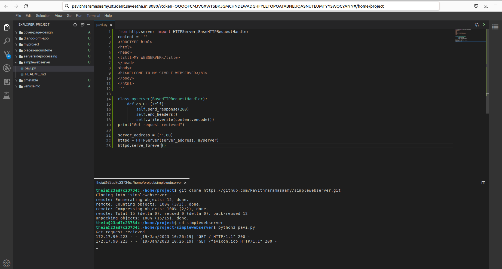
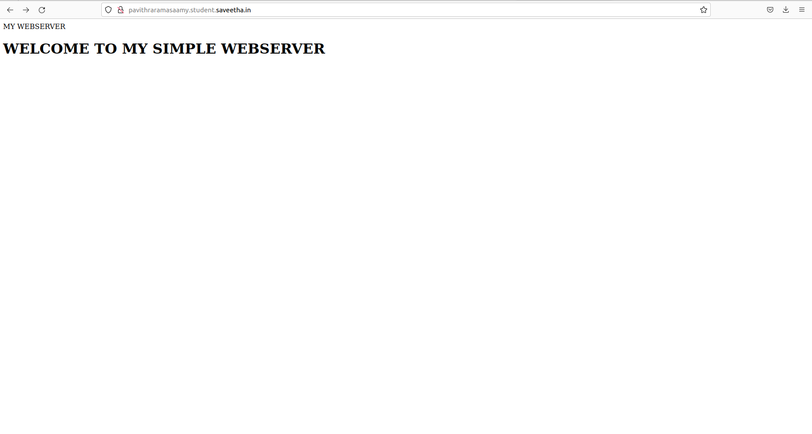

# Developing a Simple Webserver
## AIM:
To develop a simple webserver to display about top five web application development frameworks

## DESIGN STEPS:
### Step 1: 
HTML content creation
### Step 2:
Design of webserver workflow
### Step 3:
Implementation using Python code
### Step 4:
Serving the HTML pages.
### Step 5:
Testing the webserver

## PROGRAM:
```
from http.server import HTTPServer,BaseHTTPRequestHandler
content = '''
<!DOCTYPE html>
<html>
<head>
<titlt>MY WEBSERVER</title>
</head>
<body>
<h1>WELCOME TO MY SIMPLE WEBSERVER</h1>
</body>
</html>
'''

class myserver(BaseHTTPRequestHandler):
    def do_GET(self): 
        self.send_response(200)
        self.end_headers()
        self.wfile.write(content.encode())
print("Get request recieved")

server_address = ('',80)
httpd = HTTPServer(server_address, myserver)
httpd.serve_forever()
```


## OUTPUT:





   

 
 
 
 
 
     
     
   

## RESULT:
  Thus a webserver developed to display about top five web application development frameworks
